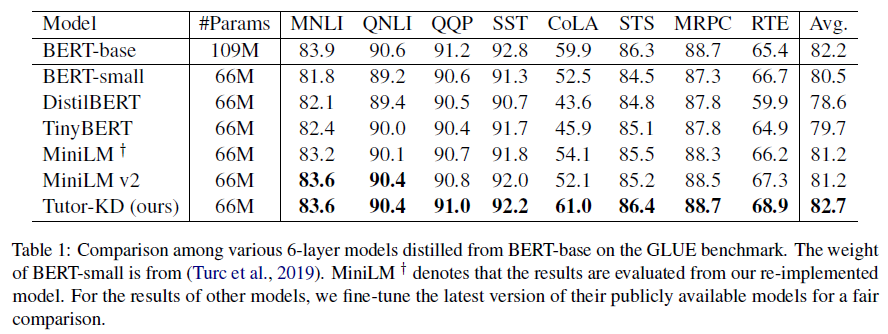
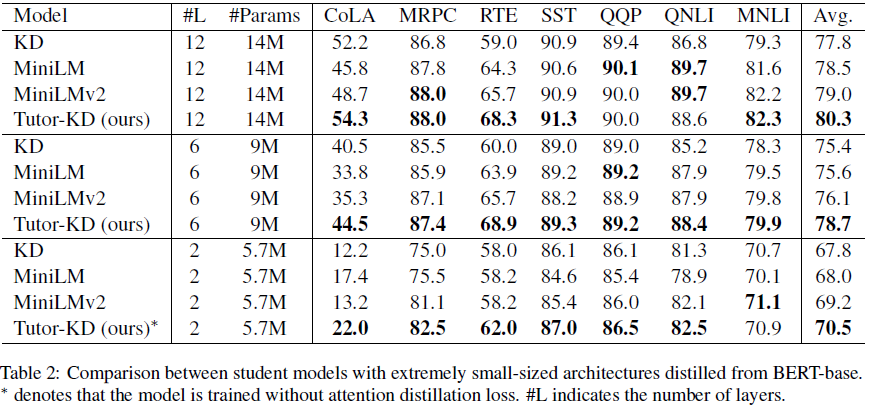

# TutorKD

This repository is about Tutor-KD long paper: [Tutoring Helps Students Learn Better: Improving Knowledge Distillation for BERT with Tutor Network](https://preview.aclanthology.org/emnlp-22-ingestion/2022.emnlp-main.498/) published in EMNLP 2022. In this project, we are interested in generating the traning samples which can mitigate the incorrect teacher predictions and repetitive learning for student.

## Overview
### Training


### Main Results



### Requirements
 - Python 3
 - Transformers 4.2.2
 - Numpy 
 - pytorch

### Quick start
Prepare the pre-training corpora(Wikipedia and Bookcorpus) in data folder. Use ```python preprocess.py```.

 - ```--data_path```: A directory containing pre-processed examples (pickle file).
 - ```--raw_data_path```: A directory containing raw text examples.

#### Distillation
Finally, use ```python distillation.py``` for distillation.

 - ```--config```: A Student model architecture. Choose model architecture from: half, extreme-12, ext-6, ext-2
 - ```--lr```: Set the learning rate.
 - ```--epochs```: Set the number of epochs. 
 - ```--batch_size```: Set the batch size for conducting at once. 
 - ```--step_batch_size```: Set the batch size for updating per each step (If the memory of GPU is enough, set the batch_size and step_batch_size the same.
 - ```--data_path```: A directory containing pre-processed examples.
 - ```--model_save_path```: Set the directory for saving the student model


## Contact Info 
For help or issues using Tutor-KD, please submit a GitHub issue. 

For personal communication related to Tutor-KD, please contact Junho Kim ```<monocrat@korea.ac.kr>```.
